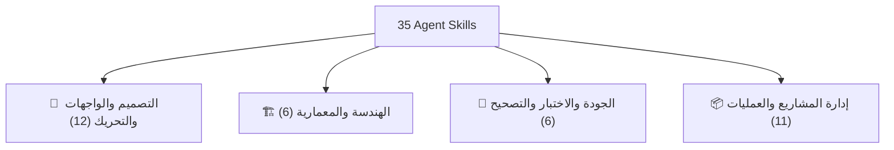

# 📚 الدليل الشامل لاستخدام جميع الـ Agent Skills الـ 35

تحدد هذه الوثيقة المرجع الشامل لكيفية الاستفادة وتفعيل كافة المهارات البرمجية الـ 35 المثبتة في المشروع (`.agents/skills/`) أثناء عمليات التطوير، التصميم، المراجعة، والاختبار.

---

## 🗺️ الفهرس والتصنيف العام

---

## 🎨 1. مهارات الواجهات والتصميم والتفاعل (12 مهارات)

| اسم المهارت | الوصف وآلية الاستخدام | متى تـُفعل تلقائياً؟ |
| :--- | :--- | :--- |
| **`design-taste-frontend`** | هندسة واجهات احترافية خالية من المظهر التكراري، اختيار ألوان متناسقة، وتأثيرات بصرية فاخرة. | عند بناء صفحات الهبوط، اللوحات، أو إعادة تصميم الواجهات. |
| **`emil-design-eng`** | الدقة والتفاصيل في صقل المكونات، تفاعلات الـ Micro-interactions، واللمسات الصغيرة التي تجعل التطبيق ممتازاً. | عند إضافة مكونات تفاعلية، أزرار، بطاقات، أو أشكال حركية دقيقة. |
| **`apple-design`** | تطبيق فلسفة تصميم Apple: حركات فيزيائية مرنة، تأثيرات العمق الزجاجي (Glassmorphism)، وخطوط بصرية متوازنة. | عند تصميم واجهات تفاعلية سريعة، سحب وتنقل، أو قوائم زجاجية. |
| **`animate`** | بناء الحركات والانتقالات من الصفر وفق معايير الفيزيائية وتسارع GPU ودعم إمكانية المقاطعة. | عند طلب إضافة تحريك خاص لخاصية أو انتقال بين الصفحات. |
| **`animation-vocabulary`** | قاموس معرفي لتحديد واستخراج أسماء أنماط الحركة والمؤثرات البصرية بدقة. | عند التساؤل عن اسم تأثير حركي معين أو نمط تفاعلي. |
| **`ask-sonner`** | استخدام وموائمة مكتبة Sonner للإشعارات والتنبيهات المباشرة للتصاميم المختلفة. | عند بناء تنبيهات، رسائل النجاح/الخطأ، أزرار التراجع والتتبع. |
| **`pick-ui-library`** | اختيار أفضل مكتبة واجهات ومكونات جاهزة من قائمة منتقاة وموثوقة بدلاً من المكونات العشوائية. | عند الحاجة لمكون معقد (رسوم بيانية، جداول ضخمة، أدوات تاريخ). |
| **`find-animation-opportunities`** | فحص الواجهات واستكشاف العناصر الثابتة التي تقبل إضافة حركة تفاعلية دون إزعاج. | عند طلب تحسين تفاعلية صفحة أو مكون ثابت. |
| **`improve-animations`** | مراجعة شاملة وتحليل لأداء الحركة في الكود وتقديم خطة تنفيذية لتحسينها. | عند التدقيق على سلاسة الحركة أو إزالة أي بطء وتجميد بالصفحة. |
| **`review-animations`** | تقييم كود الحركة الحالي ومقارنته بمعايير التصميم الحركي العالي. | قبل دمج أي كود يحتوي على حركات وتأثيرات حركية. |
| **`prototype`** | بناء وتوفير عدة نماذج مختلفة ومستقلة لنفس الواجهة لمعاينتها واختيار الأفضل حياً. | عند استكشاف أفكار وتصاميم جديدة لمكون أو صفحة. |
| **`frontend-ui-engineering`** | التنفيذ الهندسي المتكامل للواجهات البرمجية والتأكد من التجاوب التام وسهولة الوصول (WCAG). | أثناء تحويل التصاميم والمواصفات إلى كود عملي متكامل. |

---

## 🏗️ 2. مهارات الهندسة والمعمارية (6 مهارات)

| اسم المهارت | الوصف وآلية الاستخدام | متى تـُفعل تلقائياً؟ |
| :--- | :--- | :--- |
| **`api-and-interface-design`** | تصميم عقود وتأطير الواجهات البرمجية (REST/GraphQL/Types) بأسلوب ثابت وقابل للتوسع. | عند إنشاء أو تعديل Endpoints جديدة أو تحديث نماذج البيانات. |
| **`documentation-and-adrs`** | توثيق القرارات المعمارية المهمة وسجل خيارات البنية البرمجية (ADRs). | عند اتخاذ قرار معماري رئيسي يغير هيكلية المشروع. |
| **`context-engineering`** | تنظيم وإدارة سياق الكود والسجلات لضمان جودة الاستجابات والأداء الفائق. | عند تشغيل مهام معقدة تحتاج ربط أجزاء متعددة من النظام. |
| **`deprecation-and-migration`** | التخطيط والتنفيذ الآمن لتحديث الأكواد القديمة ونقل الخدمات بدون كسر التوافقية. | عند ترقية مكتبة رئيسية أو استبدال ميزة قديمة بأخرى حديثة. |
| **`source-driven-development`** | الاعتماد على مصادر الكود الموثوقة والتوثيق الرسمي بدلاً من التكهن أو الفرضيات. | عند كتابة كود يخص مكتبات أو إطارات عمل معقدة. |
| **`spec-driven-development`** | كتابة المواصفات الفنية المحددة بدقة قبل البدء في مرحلة التنفيذ لكبح الغموض. | عند إطلاق ميزة جديدة غير واضحة المعالم بالكامل. |

---

## 🧪 3. مهارات الجودة والتدقيق والتصحيح (6 مهارات)

| اسم المهارت | الوصف وآلية الاستخدام | متى تـُفعل تلقائياً؟ |
| :--- | :--- | :--- |
| **`browser-testing-with-devtools`** | فحص واختبار الواجهات بالمتصفح وقراءة Console Errors وعناصر الـ DOM مباشرة. | أثناء استكشاف مشاكل العرض أو التشغيل وتأكيد الأداء حياً. |
| **`code-review-and-quality`** | مراجعة الكود البرمجي وتقييم المعايير الأمنية والأداء قبل الاعتماد النهائي. | قبل إنهاء أو دمج أي كود جديد في المشروع. |
| **`code-simplification`** | إعادة هيكلة وتنظيف الكود لزيادة القراءة والسهولة دون تغيير السلوك. | بعد كتابة الكود التأكدي لتبسيطه وإزالة التكرار. |
| **`debugging-and-error-recovery`** | التشخيص المنظم المبني على الأدلة والسجلات لمعالجة جذور المشاكل مباشرة. | فور ظهور خطأ تشغيلي أو فشل في بناء الكود (Build Errors). |
| **`doubt-driven-development`** | إخضاع القرارات والاقتراضات لاختبارات صارمة وحالات حافة (Edge cases) قبل الاعتماد. | عند التعامل مع منطق مالي، أمني، أو بيانات حساسة. |
| **`test-driven-development`** | كتابة واختبارات الأكواد عبر منهجية TDD لتأكيد السلامة ومسار العمل البرمجي. | عند كتابة وظائف حاسوبية أو منطق أعمال حساس (Business Logic). |

---

## 📦 4. مهارات إدارة المشروع والعمليات (11 مهارات)

| اسم المهارت | الوصف وآلية الاستخدام | متى تـُفعل تلقائياً؟ |
| :--- | :--- | :--- |
| **`ci-cd-and-automation`** | بناء وإدارة أنابيب الفحص والتطوير والتسليم التلقائي (GitHub Actions/Pipelines). | عند إعداد بيئات الاختبار والنشر الآلي. |
| **`git-workflow-and-versioning`** | إدارة الفروع وتنظيم commit messages والالتزام بإصدارات SemVer. | أثناء إدارة التغييرات البرمجية والرفع لمستودعات Git. |
| **`idea-refine`** | تحويل الأفكار العامة والمبهمة إلى متطلبات تقنية محددة وقابلة للتنفيذ. | عند تقديم فكرة ميزة جديدة تحتاج لتأطير. |
| **`incremental-implementation`** | تقسيم وتنفيذ الميزات الكبيرة على مراحل صغيرة متدرجة لتفادي الأخطاء الكبيرة. | عند كتابة تغييرات تؤثر على ملفات ومكونات متعددة. |
| **`interview-me`** | إجراء حوار تفاعلي لطرح أسئلة توضيحية واستخراج المتطلبات الدقيقة قبل العمل. | عند التردد في فهم قصد المستخدم أو وجود خيارات تصميمية متعددة. |
| **`observability-and-instrumentation`** | إضافة سجلات التتبع (Logging) وقياس الأداء والمراقبة الحية للنظام. | عند إطلاق ميزات بالإنتاج تتطلب مراقبة أداء التشغيل. |
| **`performance-optimization`** | تحسين سرعة التطبيق، تخفيض أحجام الملفات الحزمة (Bundles)، وتحسين أداء الذاكرة. | عند قياس وملاحظة بطء في تحميل الصفحات أو استجابة الواجهة. |
| **`planning-and-task-breakdown`** | تفكيك الأهداف البرمجية إلى خطوات تنفيذية مرتبة ومنطقية. | قبل البدء بمشروع أو ميزة ضخمة. |
| **`security-and-hardening`** | تأمين الكود ضد الثغرات البرمجية والتحقق من المدخلات والصلاحيات. | عند التعامل مع المصادقة (Auth)، الصلاحيات، ومدخلات المستخدم. |
| **`shipping-and-launch`** | فحص قائمة الاستعداد والتأكد من إمكانية الإطلاق والجاهزية الإنتاجية. | قبل رفع التحديثات النهائية لبيئة الإنتاج الحية. |
| **`using-agent-skills`** | اكتشاف وتوجيه واستدعاء المهارات البرمجية الذكية المناسبة بكل كفاءة. | إدارة السياق وتوجيه اختيار المهارات المناسبة لكل خطوة. |

---

## ⚡ كيف تعمل المهارات معاً في تطبيق `code-feedback-loop`؟

مثال عملي: **بناء ميزة التغذية الراجعة التفاعلية (Feedback Dashboard)**:

1. **التخطيط**: تـُستدعى مهارة `planning-and-task-breakdown` لتفكيك الميزة.
2. **المواصفات والتصميم**: تـُستخدم مهارة `spec-driven-development` مع `design-taste-frontend` و `apple-design` لتحديد الهيكل والجماليات.
3. **التطوير والحركة**: تـُطبق مهارة `frontend-ui-engineering` مع `animate` و `ask-sonner` لإضافة حركات الفيزيائية والتنبيهات المباشرة.
4. **التأمين والاختبار**: تـُفحص الميزة عبر `security-and-hardening` و `browser-testing-with-devtools` و `code-review-and-quality`.
5. **التحقق والتسليم**: يتم التأكد من البناء (`npm run build`) عبر مهارة `shipping-and-launch`.
